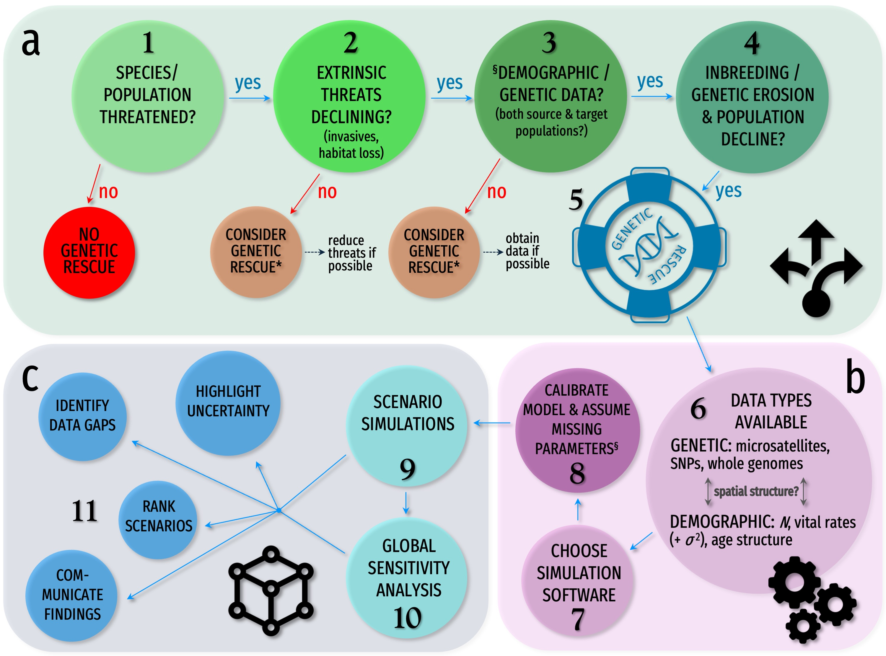

# Demo-genetic models to simulate genetic rescue

Code for <a href="http://www.messerlab.org/slim"><em>SLiM</em></a> 4.0 demo-genetic models examining the population effects of genetic rescue  
 
<em>SLiM</em> ('<strong>S</strong>election on <strong>Li</strong>nked <strong>M</strong>utations') is an <a href="http://doi.org/10.1086/723601">individual-based, forward-in-time simulator</a> designed for studies of evolutionary genetics.  
 
<a href=mailto:julian.beaman@flinders.edu.au>Julian Beaman</a> & <a href=mailto:corey.bradshaw@flinders.edu.au>Corey Bradshaw</a>  
<a href="https://globalecologyflinders.com/">Global Ecology</a> | <em>Partuyarta Ngadluku Wardli Kuu</em>  
Flinders University  
April 2024  
 
Accompanies paper: 
 
<a href="https://www.flinders.edu.au/people/julian.beaman">Beaman, JE</a>, <a href="https://molecularecology.flinders.edu.au/molecular-ecology-lab/people/postdoctoral-fellows/dr-katie-gates-2/">K Gates</a>, <a href="https://www.flinders.edu.au/people/frederik.saltre">F Saltré</a>, <a href="https://www.sydney.edu.au/science/about/our-people/academic-staff/carolyn-hogg.html">CJ Hogg</a>, <a href="https://www.sydney.edu.au/science/about/our-people/academic-staff/kathy-belov.html">K Belov</a>, <a href="https://scholar.google.com/citations?user=2xF8xocAAAAJ&hl=en">K Ashman</a>, <a href="https://www.flinders.edu.au/people/karen.burkedasilva">K Burke da Silva</a>, <a href="https://www.flinders.edu.au/people/luciano.beheregaray">LB Beheregaray</a>, <a href="https://www.flinders.edu.au/people/corey.bradshaw">CJA Bradshaw</a>. A guide for developing demo-genetic models to simulate genetic rescue. <em>Evolutionary Applications</em> In review

### Abstract
Genetic rescue is now a serious management consideration for protecting small and isolated populations from the negative effects of inbreeding and genetic drift on genetic diversity and population viability. However, such populations might be already vulnerable to random fluctuations in growth rates (demographic stochasticity). Therefore, the success of genetic rescue depends not only on the genetic composition of the source and target populations, but also on the emergent outcome of interacting demographic processes and other stochastic events. Developing predictive models that account for feedback between demographic and genetic processes ('demo-genetic feedback') is therefore necessary to guide genetic-rescue interventions that potentially minimise the risk of extinction of threatened populations. We review the available software and explore how they could be used to develop practical simulations that incorporate demo-genetic feedback to plan and implement scenarios of genetic rescue. We then present a summary of a literature search of available genetic data using Australian threatened marsupials as a case study. We conclude with a guided approach for making model-based decisions on implementing genetic rescue.

## Scripts
- <code>demographicAlleemodel.txt</code>: <em>SLiM</em> 4.0 code to generate a model of demographic Allee effects that included only the influence of demographic stochasticity on population growth.
- <code>genetic-Allee_model.txt</code>: <em>SLiM</em> 4.0 code to generate a model of genetic Allee effects that only included partially recessive deleterious mutations that accumulate in the population prior to an abrupt crash in abundance
- <code>demo-genetic-Allee_model.txt</code>: <em>SLiM</em> 4.0 code to generate a model of demo-genetic Allee effects that includes both demographic stochasticity as described in <code>demographicAlleemodel.txt</code> and partially recessive deleterious mutations as described in <code>genetic-Allee_model.txt</code>.
- <code>rescue-scenario-4_model.txt</code>: <em>SLiM</em> 4.0 code to generate genetic rescue (scenario 4: 100 individuals moved 3 times at 250, 255, and 260 years after demographic decline) scenario.
- <code>R code Figure 3.R</code>: R code to generate data for Figure 3.

 
 

 &nbsp; &nbsp;  &nbsp; &nbsp; &nbsp;  &nbsp; &nbsp; &nbsp;  &nbsp; &nbsp; &nbsp; &nbsp; 
